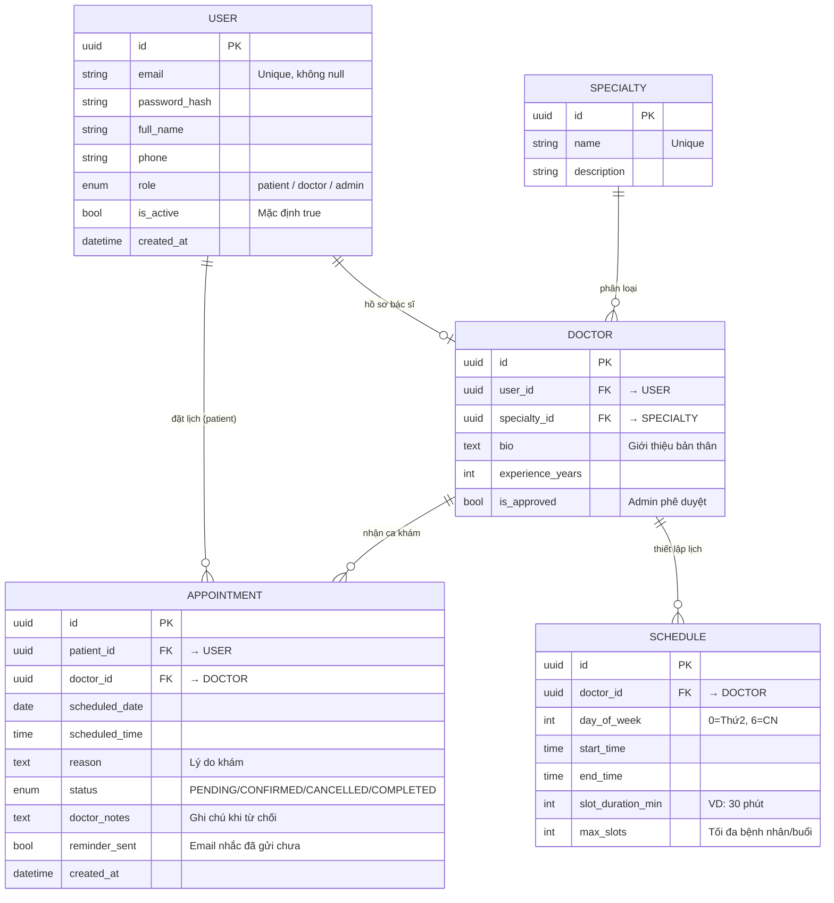
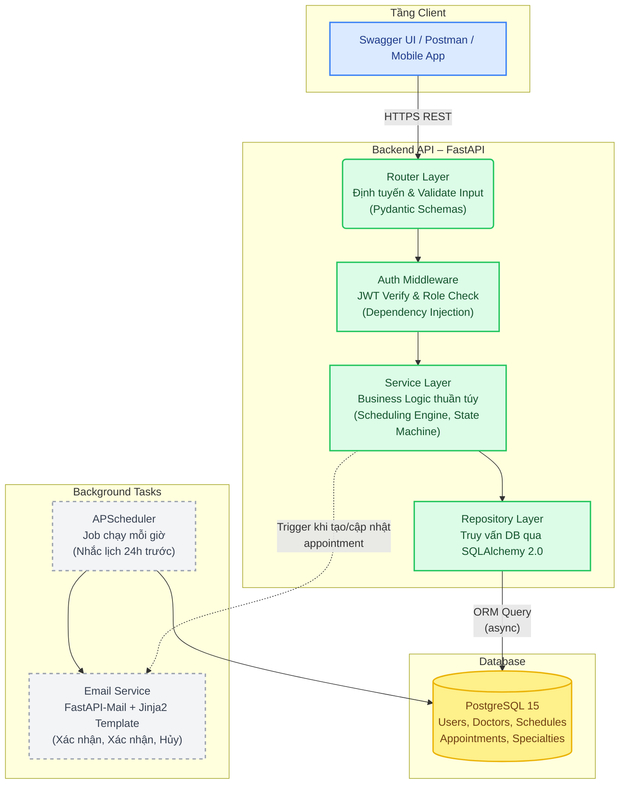
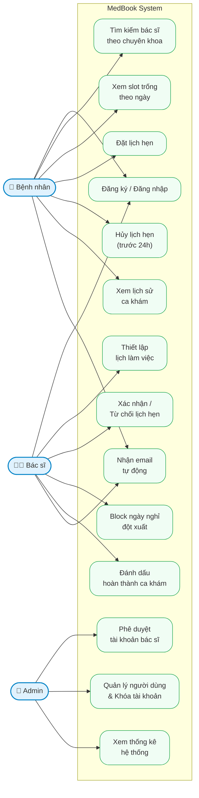

# MedBook-Online-Medical-Appointment-Booking-System
# Project Proposal

## THÔNG TIN

### Nhóm

- Thành viên 1: Trương Thế Hải Thịnh - 23725051
- Thành viên 2: Nguyễn Thị Quỳnh Trang - 

### Git

Git repository: https://github.com/TruongTheHaiThinh/MedBook-Online-Medical-Appointment-Booking-System

---

# MÔ TẢ DỰ ÁN: MEDBOOK – HỆ THỐNG ĐẶT LỊCH KHÁM BỆNH TRỰC TUYẾN (PATIENT APPOINTMENT BOOKING SYSTEM)

## 1. Ý TƯỞNG DỰ ÁN (THE VISION)

**Tổng quan nền tảng**  
Trong bối cảnh hệ thống y tế Việt Nam đang chịu áp lực quá tải nghiêm trọng, đặc biệt tại các phòng khám đa khoa và bệnh viện quận huyện, nhóm chúng tôi quyết định xây dựng **MedBook** – một nền tảng Web API chuyên biệt giải quyết bài toán điều phối lịch hẹn khám bệnh. Đây không chỉ là một hệ thống "đặt lịch" thông thường, mà được định vị là một **"Trung tâm điều phối y tế thông minh"** dành cho phòng khám tư nhân và trạm y tế địa phương – những cơ sở đang thiếu công cụ số hóa phù hợp với quy mô và ngân sách của họ.

**Tại sao chúng tôi chọn dự án này? (Giải quyết "Nỗi đau" – Pain Points của người dùng)**  
Qua phân tích thực tế, cả bệnh nhân lẫn cơ sở y tế đều đang đối mặt với 3 vấn đề cốt lõi:  
- **"Xếp hàng không hồi kết":** Bệnh nhân phải đến phòng khám từ sáng sớm để lấy số, mất hàng giờ chờ đợi không biết thứ tự của mình. Người cao tuổi, bệnh nhân nặng, hay người đi làm ban ngày đều không có giải pháp thay thế.  
- **Quản lý lịch thủ công và dễ xung đột:** Phòng khám nhỏ thường ghi lịch bằng sổ tay hoặc Excel, dẫn đến trùng ca khám, bỏ sót lịch hẹn, và không có cơ chế thông báo tự động cho bệnh nhân khi có thay đổi.  
- **Thiếu dữ liệu để cải thiện dịch vụ:** Không có hệ thống thống kê, phòng khám không thể biết khung giờ nào quá tải, bác sĩ nào được đặt nhiều nhất, hay tỷ lệ bệnh nhân hủy lịch để điều chỉnh vận hành.

**Lợi thế cạnh tranh – Tại sao MedBook khác biệt?**  
Thị trường hiện có các nền tảng như BookingCare, Medpro, hay Jamie, nhưng tất cả đều nhắm đến bệnh viện lớn với chi phí tích hợp cao và quy trình onboard phức tạp. MedBook khai thác ngách khác biệt hoàn toàn:  
- **Vượt trội hơn BookingCare/Medpro:** Các nền tảng này yêu cầu tích hợp HIS (Hospital Information System) tốn kém. MedBook cung cấp REST API đơn giản – phòng khám nhỏ có thể vận hành trong vài giờ mà không cần đội kỹ thuật riêng.  
- **Tối ưu hơn Excel/Google Form thủ công:** Thay vì nhân viên phải gọi điện xác nhận từng lịch hẹn, MedBook tự động hóa toàn bộ luồng: đặt → xác nhận → nhắc lịch → hoàn thành, với email tự động ở mỗi bước.  
- **Phù hợp hơn cho quy mô nhỏ:** Không cố nhồi nhét mọi tính năng như hệ thống cồng kềnh, MedBook hoàn thiện nghiệp vụ cốt lõi với API docs đầy đủ, dễ mở rộng khi phòng khám phát triển.

**3 Trụ cột kỹ thuật của MedBook:**  
- **API-First Design:** Toàn bộ hệ thống xây dựng dưới dạng RESTful API (FastAPI + Python), tự động sinh tài liệu Swagger/OpenAPI, tích hợp được với bất kỳ frontend hay mobile app nào.  
- **Smart Scheduling Engine:** Thuật toán tự động tính slot khả dụng từ lịch làm việc của bác sĩ – không lưu từng slot cứng vào DB, không cho phép đặt trùng lịch, xử lý đúng đắn khi bác sĩ đổi lịch đột xuất.  
- **Automated Notification Pipeline:** Email xác nhận tức thì khi đặt lịch thành công; email nhắc lịch tự động 24 giờ trước ca khám – không cần nhân viên can thiệp thủ công.

---

## 2. CHI TIẾT NGHIỆP VỤ (BUSINESS LOGIC)

Hệ thống được thiết kế xoay quanh 3 vai trò người dùng với luồng nghiệp vụ rõ ràng, phù hợp để phân công phát triển theo module cho nhóm 2 người:

### Module 1: Quản lý Tài khoản & Phân quyền  
- **Nghiệp vụ:** Xây dựng hệ thống xác thực làm nền tảng bảo mật cho toàn bộ API. Module này phải hoàn thành đầu tiên để các module khác có thể hoạt động an toàn.  
- **Chi tiết:** Hệ thống hỗ trợ 3 vai trò: **Bệnh nhân (Patient)** – tìm kiếm và đặt lịch khám; **Bác sĩ (Doctor)** – quản lý lịch làm việc và xác nhận ca khám; **Quản trị viên (Admin)** – giám sát toàn hệ thống và phê duyệt tài khoản. Xác thực dựa trên JWT (Access Token ngắn hạn 30 phút + Refresh Token 7 ngày). Tài khoản bác sĩ sau khi đăng ký sẽ ở trạng thái chờ, cần Admin phê duyệt trước khi được phép thiết lập lịch và nhận bệnh nhân.  
- **Giá trị kỹ thuật:** Middleware phân quyền tái sử dụng được trên mọi endpoint (dependency injection của FastAPI), đảm bảo bệnh nhân không truy cập được dữ liệu của bác sĩ khác và ngược lại.

### Module 2: Quản lý Bác sĩ, Chuyên khoa & Lịch làm việc  
- **Nghiệp vụ:** Xây dựng hệ thống cho phép bác sĩ định nghĩa khung giờ làm việc một lần theo mẫu tuần, Smart Scheduling Engine tự động sinh ra các slot khả dụng cho từng ngày được truy vấn.  
- **Chi tiết:** Bác sĩ thiết lập lịch theo pattern tuần (VD: Thứ 2-4-6, 8:00–12:00, mỗi ca 30 phút, tối đa 8 bệnh nhân/buổi). Khi bệnh nhân truy vấn slot ngày 2026-04-10, engine tính: ngày đó là Thứ 6 → lấy schedule pattern tương ứng → sinh ra 8 slot từ 8:00–11:30 → lọc trừ các slot đã có appointment → trả về slot còn trống. Bác sĩ có thể tạm khóa ngày nghỉ đột xuất (block date) mà không cần xóa toàn bộ lịch.  
- **Giá trị kỹ thuật:** Slot generation chạy on-demand (không pre-generate slot vào DB), giúp hệ thống nhẹ hơn đáng kể và tự động đúng khi bác sĩ chỉnh sửa lịch làm việc.

### Module 3: Luồng Đặt lịch & Quản lý Trạng thái  
- **Nghiệp vụ:** Quản lý vòng đời hoàn chỉnh của một lịch hẹn từ lúc đặt đến khi hoàn thành, bao gồm các ràng buộc nghiệp vụ và trigger email tự động.  
- **Chi tiết:** Khi bệnh nhân chọn slot và xác nhận, hệ thống kiểm tra đồng thời hai điều kiện: slot vẫn còn trống (race condition check) và bệnh nhân chưa có lịch khác cùng giờ đó. Sau khi tạo appointment với trạng thái **PENDING**, hệ thống gửi email xác nhận tức thì. Bác sĩ xem danh sách lịch PENDING, có thể **CONFIRM** hoặc **CANCEL** kèm ghi chú lý do – mỗi thao tác đều trigger email tương ứng đến bệnh nhân. Bệnh nhân có thể tự hủy tối đa 24 giờ trước ca khám. Sau khám, bác sĩ đánh dấu **COMPLETED**.  
- **State Machine:** `PENDING → CONFIRMED → COMPLETED` hoặc `PENDING/CONFIRMED → CANCELLED` (cả hai phía đều có thể hủy).

### Module 4: Thống kê & Quản trị Hệ thống  
- **Nghiệp vụ:** Cung cấp Admin cái nhìn tổng quan về hoạt động hệ thống và khả năng can thiệp khi cần thiết.  
- **Chi tiết:** Admin xem dashboard thống kê bằng aggregation query trực tiếp trên PostgreSQL: tổng lịch hẹn theo ngày/tuần/tháng, tỷ lệ CONFIRMED/CANCELLED theo từng bác sĩ, số bệnh nhân mới đăng ký trong kỳ. Admin phê duyệt hoặc từ chối tài khoản bác sĩ sau khi xác minh thông tin. Admin có thể khóa tài khoản vi phạm, xem và can thiệp vào bất kỳ lịch hẹn nào trong hệ thống.  
- **Giá trị kỹ thuật:** Response JSON từ API thống kê được thiết kế sẵn sàng để render chart – frontend chỉ cần nhận và vẽ, không cần xử lý thêm.

---

## PHÂN TÍCH & THIẾT KẾ

> **Ghi chú:** Nhóm sử dụng phương pháp MoSCoW để phân định rõ phạm vi dự án, đảm bảo tính khả thi cho nhóm 2 người trong thời gian đồ án nhưng vẫn giữ được chiều sâu kỹ thuật của hệ thống.

### 1. Yêu cầu chức năng hệ thống

#### Nhóm MUST-HAVE (Bắt buộc phải có – Scope cho MVP):  
Đây là các chức năng cốt lõi tạo thành vòng đời hoàn chỉnh của một lịch hẹn.

- **Quản lý Tài khoản:**  
  - **Đăng ký/Đăng nhập:** Hỗ trợ cả 3 vai trò (Patient, Doctor, Admin). Tài khoản Doctor cần Admin phê duyệt trước khi kích hoạt.  
  - **Ràng buộc:** Email chuẩn format `^[A-Za-z0-9._%+-]+@[A-Za-z0-9.-]+\.[A-Za-z]{2,}$`. Mật khẩu tối thiểu 8 ký tự (gồm chữ hoa, chữ thường, chữ số). Mật khẩu hash bằng `bcrypt` trước khi lưu DB.  
  - **Quản lý hồ sơ:** Bệnh nhân cập nhật họ tên (3-100 ký tự), số điện thoại. Bác sĩ cập nhật thêm bio (tối đa 1000 ký tự), số năm kinh nghiệm.

- **Module Quản lý Bác sĩ & Chuyên khoa:**  
  - **CRUD Chuyên khoa (Admin):** Tạo, sửa, xóa danh mục chuyên khoa (Tim mạch, Nội tổng quát, Da liễu...). Ràng buộc: Tên chuyên khoa không trùng lặp, không thể xóa chuyên khoa còn bác sĩ đang hoạt động.  
  - **Hồ sơ Bác sĩ:** Bác sĩ sau khi được phê duyệt có thể cập nhật hồ sơ và liên kết với một chuyên khoa.  
  - **Xem danh sách bác sĩ (Public):** Lọc theo chuyên khoa, tên. Trả về thông tin cơ bản (tên, chuyên khoa, kinh nghiệm).

- **Module Lịch làm việc & Slot:**  
  - **Thiết lập lịch làm việc:** Bác sĩ định nghĩa pattern tuần: ngày trong tuần, giờ bắt đầu/kết thúc, thời gian mỗi ca (phút), số bệnh nhân tối đa mỗi buổi.  
  - **Ràng buộc:** `start_time < end_time`, `slot_duration_min` phải là ước của `(end_time - start_time)`, `max_slots >= 1`.  
  - **API lấy slot trống:** Nhận input là `doctor_id` và `date`, trả về danh sách slot khả dụng. Slot đã có appointment PENDING hoặc CONFIRMED sẽ bị loại khỏi kết quả.

- **Module Appointments (Lịch hẹn):**  
  - **Đặt lịch (Patient):** Chọn doctor, date, time_slot, nhập reason (tùy chọn, tối đa 500 ký tự). Validate: slot còn trống, ngày hẹn không phải quá khứ, bệnh nhân chưa có lịch khác cùng giờ.  
  - **Xác nhận/Từ chối (Doctor):** Chuyển trạng thái PENDING → CONFIRMED hoặc CANCELLED. Nếu CANCELLED, bắt buộc nhập `doctor_notes` (lý do).  
  - **Hủy lịch (Patient):** Chỉ được hủy trước 24 giờ so với `scheduled_datetime`. Sau 24 giờ, chỉ Doctor hoặc Admin mới hủy được.  
  - **Đánh dấu hoàn thành (Doctor):** Chuyển CONFIRMED → COMPLETED sau khi bệnh nhân đã khám xong.

- **Module Email Notification:**  
  - Gửi email khi: bệnh nhân đặt lịch thành công (PENDING), bác sĩ xác nhận (CONFIRMED), bất kỳ bên nào hủy (CANCELLED).  
  - Email template HTML hiển thị đầy đủ: tên bác sĩ, ngày giờ, địa chỉ phòng khám.

#### Nhóm SHOULD-HAVE:  
- **Email nhắc lịch tự động:** Background job (APScheduler) chạy mỗi giờ, quét các appointment CONFIRMED có `scheduled_datetime` trong khoảng 24–25 giờ tới và chưa có `reminder_sent = True`, gửi email nhắc lịch và đánh dấu đã gửi.  
- **Block date (Doctor):** Bác sĩ tạo ngày nghỉ đột xuất – mọi slot của ngày đó trả về trống khi truy vấn.  
- **Phân trang (Pagination):** Tất cả list endpoint hỗ trợ `?page=1&size=20` để tránh query toàn bộ bảng.

#### Nhóm COULD-HAVE:  
- **Đánh giá bác sĩ (Rating):** Sau khi appointment chuyển COMPLETED, bệnh nhân có thể gửi đánh giá 1-5 sao kèm comment (tối đa 300 ký tự). Mỗi appointment chỉ đánh giá được 1 lần.  
- **Dashboard thống kê Admin:** Biểu đồ số lịch hẹn theo ngày trong 30 ngày gần nhất, top 5 bác sĩ được đặt nhiều nhất.

---

### 2. Yêu cầu Phi chức năng

- **Bảo mật:**  
  - Mật khẩu phải hash bằng `bcrypt` (cost factor ≥ 12) trước khi lưu Database.  
  - Toàn bộ route API (ngoại trừ `/auth/register`, `/auth/login`, `GET /doctors`) phải xác thực JWT.  
  - Rate limiting cho endpoint đăng nhập (tối đa 5 lần thất bại/phút/IP) để chống brute-force.  
- **Tính nhất quán dữ liệu:**  
  - Race condition khi nhiều bệnh nhân cùng đặt 1 slot: sử dụng DB transaction với `SELECT FOR UPDATE` để tránh double-booking.  
  - Không thể xóa Doctor nếu còn appointment đang PENDING hoặc CONFIRMED.  
- **Hiệu năng:**  
  - Các list endpoint hỗ trợ pagination. Index DB trên các cột thường xuyên filter: `appointments.doctor_id`, `appointments.scheduled_date`, `appointments.status`.  
  - Response time mục tiêu < 500ms cho 95% request trong điều kiện bình thường.  
- **Tính bảo trì:**  
  - Source code theo kiến trúc phân tầng Router → Service → Repository, dễ test từng layer độc lập.  
  - Có file `README.md` với hướng dẫn cài đặt local, cấu hình biến môi trường `.env.example`, và lệnh chạy migration.

---

### 3. Mô hình Thực thể Dữ liệu (Entity Relationship – Lược đồ mức logic)

Hệ thống được thiết kế xoay quanh 5 thực thể (Entities) cốt lõi:  
1. **USER:** `id`, `email`, `password_hash`, `full_name`, `phone`, `role`, `is_active`, `created_at`.  
2. **DOCTOR:** `id`, `user_id`, `specialty_id`, `bio`, `experience_years`, `is_approved`.  
3. **SPECIALTY:** `id`, `name`, `description`.  
4. **SCHEDULE:** `id`, `doctor_id`, `day_of_week`, `start_time`, `end_time`, `slot_duration_min`, `max_slots`.  
5. **APPOINTMENT:** `id`, `patient_id`, `doctor_id`, `scheduled_date`, `scheduled_time`, `reason`, `status`, `doctor_notes`, `reminder_sent`, `created_at`.

---

### 4. Kiến trúc hệ thống

---

### 5. Use case diagram

---

### 6. Công nghệ sử dụng (Tech Stack)

- **Backend:** Python 3.11+, FastAPI, SQLAlchemy 2.0 (async), Alembic (migration)
- **Database:** PostgreSQL 15
- **Authentication:** python-jose (JWT), passlib + bcrypt
- **Email:** FastAPI-Mail, Jinja2 (HTML template)
- **Background Tasks:** APScheduler
- **Testing:** Pytest, httpx (AsyncClient)
- **Containerization:** Docker, Docker Compose
- **Deployment:** Railway hoặc Render (Backend) + Supabase hoặc Railway Postgres (DB)
- **API Docs:** Swagger UI + ReDoc (tự sinh từ FastAPI)

---

## KẾ HOẠCH

### MVP

**1. Mô tả các chức năng MVP (Thời hạn hoàn thành: 12.04.2026)**  
Ở giai đoạn MVP, hệ thống sẽ hoàn thiện toàn bộ luồng nghiệp vụ cốt lõi (nhóm MUST-HAVE) để đảm bảo vòng đời sử dụng hoàn chỉnh từ đăng ký đến kết thúc ca khám:  
- **Xác thực & Phân quyền:** Đăng ký, đăng nhập cả 3 vai trò. JWT middleware bảo vệ toàn bộ endpoint. Admin phê duyệt tài khoản bác sĩ.  
- **Quản lý Chuyên khoa & Bác sĩ:** Admin CRUD chuyên khoa. Bác sĩ cập nhật hồ sơ và liên kết chuyên khoa.  
- **Lịch làm việc & Smart Scheduling Engine:** Bác sĩ thiết lập pattern lịch tuần. API `/available-slots` tính và trả về slot trống theo ngày.  
- **Luồng Đặt lịch đầy đủ:** Bệnh nhân đặt → Doctor xác nhận/từ chối → Bệnh nhân/Doctor hủy → Doctor đánh dấu hoàn thành. Tất cả có validate ràng buộc nghiệp vụ.  
- **Email tự động:** Gửi email xác nhận ở các bước: tạo lịch (PENDING), xác nhận (CONFIRMED), hủy (CANCELLED).  
- **API Docs:** Swagger UI hoàn chỉnh, mọi endpoint có mô tả, schema request/response và ví dụ.

**2. Kế hoạch kiểm thử**  
Quá trình kiểm thử tập trung vào tính nhất quán dữ liệu, ràng buộc nghiệp vụ và phân quyền. Dưới đây là các Test Case (TC) trọng tâm phục vụ **Manual Testing**:

| Mã TC | Module | Hành động | Kết quả mong đợi |
| :--- | :--- | :--- | :--- |
| **TC-01** | Auth | Đăng ký với email sai format (vd: `patient@.com`) hoặc mật khẩu `abc123` (thiếu chữ hoa). | Hệ thống trả `422 Unprocessable Entity`, body chứa thông báo lỗi cụ thể từng field. |
| **TC-02** | Auth | Gọi endpoint `GET /appointments/me` mà không có Authorization header. | Trả về `401 Unauthorized`. |
| **TC-03** | Auth | Dùng JWT của Patient gọi endpoint `PATCH /appointments/{id}/confirm` (chỉ Doctor mới được). | Trả về `403 Forbidden`. |
| **TC-04** | Scheduling | Gọi `GET /doctors/{id}/available-slots?date=2026-04-10` với bác sĩ có lịch Thứ 6, 8:00–10:00, 30 phút/ca. | Trả về đúng 4 slot: 08:00, 08:30, 09:00, 09:30. |
| **TC-05** | Appointment | Bệnh nhân A và B cùng lúc đặt cùng 1 slot của cùng 1 bác sĩ (race condition). | Chỉ 1 bên thành công (`201 Created`), bên còn lại nhận `409 Conflict` – "Slot này vừa được đặt bởi người khác". |
| **TC-06** | Appointment | Bệnh nhân cố hủy lịch khi chỉ còn 10 giờ trước ca khám. | Trả về `400 Bad Request` – "Chỉ được hủy trước 24 giờ". |
| **TC-07** | Appointment | Doctor gọi `PATCH /appointments/{id}/cancel` mà không cung cấp `doctor_notes`. | Trả về `422` – "Vui lòng cung cấp lý do hủy". |
| **TC-08** | Email | Bệnh nhân đặt lịch thành công. | Trong vòng 30 giây, email xác nhận xuất hiện trong hộp thư của bệnh nhân, nội dung khớp với thông tin đặt lịch. |

- **Unit & Integration Testing (Pytest):**  
  - Viết Pytest với `httpx.AsyncClient` cho toàn bộ API endpoint. Mục tiêu coverage ≥ 70% trên các service và router chính.  
  - *Các test case tiêu biểu:* Kiểm tra thuật toán slot generation với nhiều scenario (bác sĩ không có lịch hôm đó, toàn bộ slot đã đầy, ngày lẻ không khớp pattern), test race condition với DB transaction, test state machine của appointment (không thể chuyển COMPLETED → PENDING), test phân quyền từng vai trò.

**3. Các chức năng dự kiến thực hiện ở Phase tiếp theo**  
- **Email nhắc lịch tự động:** Background job APScheduler quét và gửi email 24h trước ca khám.  
- **Block date:** Bác sĩ đánh dấu ngày nghỉ đột xuất, slot của ngày đó tự động trả về trống.  
- **Rating & Review:** Bệnh nhân đánh giá sau khi ca khám COMPLETED.  
- **Dashboard thống kê Admin:** Biểu đồ lịch hẹn theo thời gian, tỷ lệ xác nhận/hủy, top bác sĩ bận nhất.

---

### Beta Version  
**Thời hạn hoàn thành dự kiến:** 10.05.2026

- **Kết quả kiểm thử:**  
  - Báo cáo tổng hợp độ phủ (Code Coverage) của Pytest – mục tiêu đạt > 70% cho các service và router chính.  
  - Bảng danh sách lỗi phát hiện trong quá trình test MVP và tình trạng đã xử lý.  
- **Triển khai:**  
  - Hệ thống chạy ổn định trên môi trường cloud (Railway hoặc Render), có URL public để demo.  
  - Database trên môi trường production được migrate đúng bằng Alembic, không mất dữ liệu khi upgrade.  
- **Viết báo cáo:**  
  - Hoàn thiện tài liệu kỹ thuật: kiến trúc hệ thống, hướng dẫn cài đặt local, mô tả các quyết định thiết kế quan trọng.  
  - Viết báo cáo tổng kết đồ án cuối kỳ, phân tích những điểm đã làm được, chưa làm được và hướng phát triển tương lai.

---

## CÂU HỎI

1. **Về xử lý race condition:** Nhóm dự định dùng PostgreSQL `SELECT FOR UPDATE` bên trong một DB transaction để chặn double-booking khi nhiều bệnh nhân đặt cùng 1 slot cùng lúc. Cách tiếp cận này có phù hợp với quy mô đồ án không, hay thầy/cô có đề xuất pattern nào đơn giản hơn mà vẫn đảm bảo tính nhất quán dữ liệu?

2. **Về Smart Scheduling Engine:** Nhóm thiết kế slot generation chạy **on-demand** (tính toán khi có request, không lưu từng slot vào DB) thay vì **pre-generate** slot hàng loạt. Cách này nhẹ hơn nhưng tốn compute mỗi lần query. Với quy mô đồ án (vài trăm appointment), approach nào thầy/cô thấy phù hợp hơn để chấm điểm thiết kế DB?

3. **Về phạm vi kiểm thử:** Nhóm dự định viết Pytest (integration test với `httpx.AsyncClient`) cho ~70% endpoint quan trọng, không có E2E test do không có frontend. Mức độ này đã đủ cho yêu cầu kiểm thử của đồ án chưa, hay cần bổ sung thêm dạng test nào khác (VD: load test, contract test)?

---

