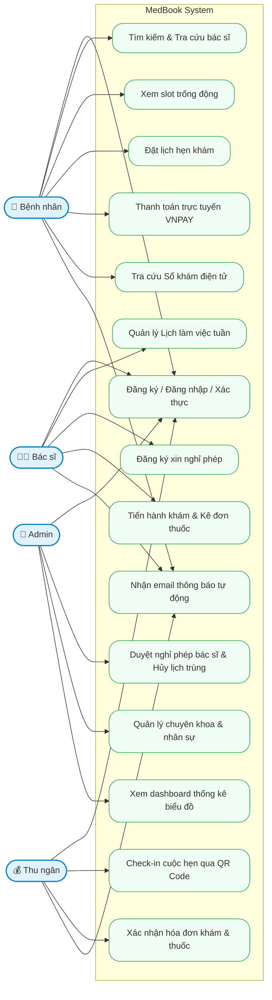
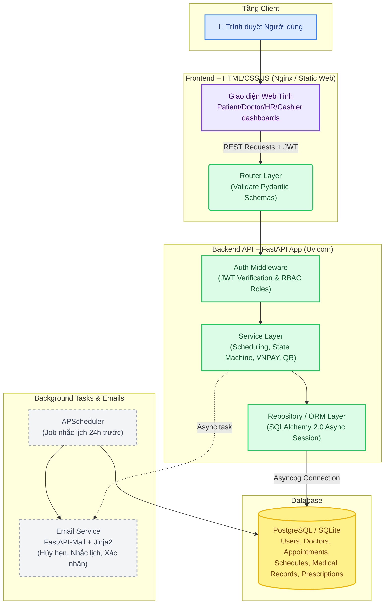
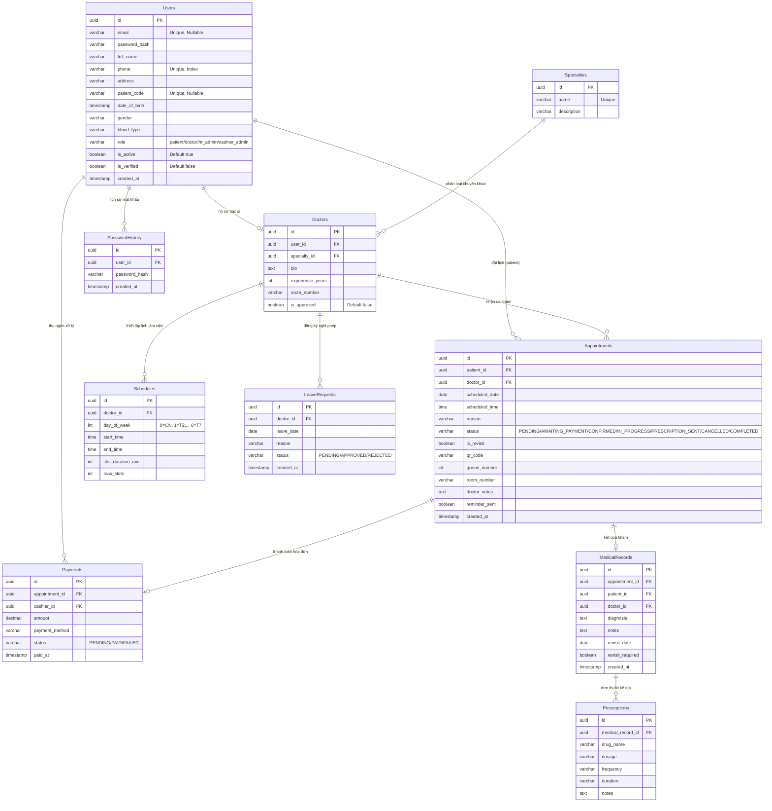

# BÁO CÁO TIẾN ĐỘ VÀ KẾT QUẢ TRIỂN KHAI DỰ ÁN MEDBOOK

## 1. GIỚI THIỆU ĐỀ TÀI
### 1.1 Mô tả bài toán
Trong bối cảnh các cơ sở y tế thường xuyên đối mặt với áp lực quá tải, quy trình đăng ký và khám chữa bệnh truyền thống bộc lộ nhiều điểm hạn chế: bệnh nhân phải xếp hàng chờ đợi lâu, bác sĩ khó khăn trong việc tra cứu tiền sử bệnh lý, thu ngân và dược sĩ tốn thời gian xử lý thủ công các thủ tục hóa đơn và cấp phát thuốc.

**MedBook** được xây dựng nhằm giải quyết triệt để bài toán này. Hệ thống số hóa toàn bộ quy trình khám chữa bệnh theo mô hình liên hoàn từ khâu đặt lịch hẹn trực tuyến, check-in bằng mã QR, bác sĩ ghi nhận bệnh án điện tử, kê đơn thuốc tự động, thu ngân tính toán viện phí đến dược sĩ cấp phát thuốc theo đơn. Nhờ vậy, phòng khám tối ưu được thời gian vận hành, nâng cao trải nghiệm của cả nhân viên y tế lẫn người bệnh.

### 1.2 Mục tiêu hệ thống
- **Đối với Bệnh nhân:** Giúp đặt lịch khám nhanh chóng, lựa chọn bác sĩ và chuyên khoa phù hợp; nhận thông báo, lộ trình khám chi tiết; thanh toán phí khám trực tuyến qua cổng VNPAY; tra cứu lịch sử khám bệnh mọi lúc mọi nơi qua Sổ khám bệnh điện tử.
- **Đối với Bác sĩ:** Quản lý lịch làm việc tuần và đăng ký nghỉ phép linh hoạt; tra cứu đầy đủ hồ sơ bệnh án lịch sử của bệnh nhân; kê đơn thuốc nhanh chóng nhờ công cụ gợi ý tên thuốc tự động từ danh mục thực tế.
- **Đối với Thu ngân phòng khám:** Tiếp nhận, xác nhận thông tin cuộc hẹn; check-in nhanh chóng bằng cách quét mã QR; xử lý hóa đơn khám bệnh và hóa đơn thuốc liên kết trực tiếp với phòng khám.
- **Đối với Quản trị hệ thống (Admin):** Phê duyệt bác sĩ mới, duyệt/từ chối lịch nghỉ phép của bác sĩ (tự động hủy lịch hẹn trùng và gửi email thông báo); quản lý danh mục chuyên khoa; quản lý/khóa người dùng; xem toàn bộ **nhật ký giao dịch tài chính** và tra cứu **hồ sơ bệnh án bệnh nhân**.

### 1.3 Phạm vi hệ thống
**Bao gồm:**
- Xác thực & Phân quyền: Đăng ký, đăng nhập dựa trên mã hóa mật khẩu `bcrypt` và xác thực JWT token (Access Token & Refresh Token). Đăng ký tài khoản bệnh nhân yêu cầu kích hoạt qua email (Verify Email Link); hỗ trợ quên mật khẩu (Forgot/Reset Password) và kiểm tra lịch sử mật khẩu cũ.
- Quy trình nghiệp vụ đầy đủ qua State Machine: `PENDING → CONFIRMED → IN_PROGRESS → PRESCRIPTION_SENT → COMPLETED`.
- Đặt lịch & Sinh slot trống động: Thuật toán tự động sinh khung giờ trống từ cấu hình lịch làm việc của bác sĩ, loại trừ các slot đã được đặt hoặc trùng ngày nghỉ phép được HR duyệt.
- Tích hợp cổng thanh toán trực tuyến: Tích hợp VNPAY Sandbox phục vụ thanh toán trực tuyến tiền đặt lịch.
- Check-in nhanh bằng QR Code: Bệnh nhân nhận mã QR sau khi thanh toán, Thu ngân quét QR để chuyển trạng thái sang khám (`IN_PROGRESS`).
- Hồ sơ & Kê đơn thuốc chuyên nghiệp: Hỗ trợ tìm kiếm nhanh gợi ý tên thuốc từ dataset 4000+ loại thuốc thực tế; hỗ trợ định dạng in khổ A5 chuẩn y tế.
- Quản lý nghỉ phép của Bác sĩ: Bác sĩ xin nghỉ phép ở trạng thái `PENDING`. Chỉ khi Admin hệ thống phê duyệt (`APPROVED`), hệ thống mới tự động hủy các lịch hẹn trùng, gửi email thông báo hủy hẹn kèm lý do cho bệnh nhân (FastAPI-Mail + SMTP).
- Dashboard thống kê trực quan và quản trị giao dịch/bệnh án cho Admin bằng biểu đồ (Chart.js).
- Đóng gói container hoàn chỉnh: Sử dụng Docker & Docker Compose chạy đa dịch vụ (PostgreSQL, Backend FastAPI, Frontend Nginx).

**Không bao gồm:**
- Chức năng tư vấn khám trực tuyến từ xa (Telemedicine) qua video call (WebRTC).
- Kết nối trực tiếp vào hệ thống Bảo hiểm Y tế Quốc gia hoặc cổng thông tin quản lý dược của Bộ Y tế.

---

## 2. PHÂN TÍCH YÊU CẦU HỆ THỐNG
### 2.1 Actors
- **Guest (Khách vãng lai):** Xem trang giới thiệu phòng khám, tra cứu danh sách bác sĩ và thông tin các chuyên khoa y tế.
- **Patient (Bệnh nhân):** Đăng ký tài khoản, kích hoạt email, đặt lịch khám theo bác sĩ/ngày/giờ, thanh toán trực tuyến qua VNPAY, xem mã QR check-in cuộc hẹn, tra cứu Sổ khám bệnh điện tử và đơn thuốc cá nhân.
- **Doctor (Bác sĩ):** Đăng ký lịch làm việc tuần, đăng ký nghỉ phép đột xuất, quản lý danh sách cuộc hẹn được phân công, thực hiện ghi nhận bệnh án, kê đơn thuốc và chỉ định tái khám cho bệnh nhân.
- **Cashier Admin (Thu ngân phòng khám):** Xác nhận lịch đặt trực tiếp, quét QR code check-in bệnh nhân khi đến khám, xử lý thanh toán hóa đơn tiền khám/tiền thuốc, cấp phát thuốc theo đơn đã hoàn thành thanh toán.
- **Admin (Quản trị hệ thống):** Tạo tài khoản nhân viên (Bác sĩ, Thu ngân), phê duyệt hồ sơ bác sĩ mới, quản lý danh mục chuyên khoa, phê duyệt/từ chối yêu cầu nghỉ phép của bác sĩ, giám sát hoạt động hệ thống qua biểu đồ thống kê, xem nhật ký giao dịch và tra cứu hồ sơ bệnh án bệnh nhân.

### 2.2 Danh sách Use Case
| ID | Use Case Name | Actors | Description |
| :---: | :--- | :--- | :--- |
| **UC-01** | Đăng ký & Đăng nhập | Guest / Patient / Doctor / Staff | Cho phép đăng ký tài khoản bệnh nhân và đăng nhập hệ thống với JWT. |
| **UC-02** | Xác thực Email | Patient | Bệnh nhân kích hoạt tài khoản thông qua link gửi về hộp thư cá nhân. |
| **UC-03** | Quên / Đặt lại mật khẩu | Patient / Doctor / Staff | Lấy lại quyền truy cập tài khoản qua email xác nhận đặt lại mật khẩu. |
| **UC-04** | Tìm kiếm Bác sĩ & Chuyên khoa | Patient / Guest | Tìm kiếm bác sĩ theo chuyên khoa và xem mô tả chi tiết. |
| **UC-05** | Tra cứu Slot giờ trống | Patient | Xem danh sách các slot khám khả dụng của bác sĩ trong một ngày cụ thể. |
| **UC-06** | Đặt lịch khám | Patient | Chọn bác sĩ, ngày giờ khám và nhập lý do để đặt lịch hẹn khám bệnh. |
| **UC-07** | Thanh toán VNPAY | Patient | Thanh toán trực tuyến 100,000đ tiền đặt lịch hẹn thông qua cổng thanh toán VNPAY. |
| **UC-08** | Nhận mã QR check-in | Patient | Nhận mã QR định danh cuộc hẹn sau khi thanh toán hoặc được xác nhận. |
| **UC-09** | Tra cứu Sổ khám điện tử | Patient | Tra cứu toàn bộ lịch sử khám bệnh, chẩn đoán và thuốc đã được kê ở các ca trước. |
| **UC-10** | Cài đặt Lịch làm việc | Doctor | Bác sĩ thiết lập cấu hình lịch làm việc tuần (thứ, khung giờ bắt đầu/kết thúc). |
| **UC-11** | Đăng ký nghỉ phép | Doctor | Bác sĩ đăng ký xin nghỉ phép (trạng thái `PENDING`) gửi lên HR Admin duyệt. |
| **UC-12** | Quản lý Ca khám bệnh | Doctor | Xem danh sách bệnh nhân chờ khám trong ngày và tiền sử bệnh lý của họ. |
| **UC-13** | Khám bệnh & Ghi bệnh án | Doctor | Nhập chẩn đoán lâm sàng, ghi chú khám bệnh, chỉ định có tái khám hay không. |
| **UC-14** | Kê đơn thuốc | Doctor | Kê đơn thuốc với chức năng gợi ý tự động tên thuốc từ dữ liệu danh mục chuẩn. |
| **UC-15** | Phê duyệt Bác sĩ | Admin | Phê duyệt/từ chối hồ sơ đăng ký tài khoản của bác sĩ mới vào hệ thống. |
| **UC-16** | Quản lý Chuyên khoa | Admin | Thực hiện CRUD danh mục chuyên khoa của phòng khám. |
| **UC-17** | Quản lý Lịch nghỉ phép | Admin | Duyệt/Từ chối yêu cầu xin nghỉ của bác sĩ, kích hoạt cơ chế tự động hủy lịch trùng và gửi email. |
| **UC-18** | Xem báo cáo Thống kê | Admin | Theo dõi số lượng cuộc hẹn, tỷ lệ xác nhận/hủy và sự tăng trưởng bệnh nhân mới. |
| **UC-19** | Check-in bằng QR Code | Cashier Admin | Thu ngân quét mã QR của bệnh nhân bằng camera hoặc nhập mã để check-in tại quầy. |
| **UC-20** | Xác nhận thanh toán | Cashier Admin | Thu ngân xác nhận thu tiền trực tiếp và lập biên nhận thanh toán. |
| **UC-21** | Thanh toán thuốc & Phát thuốc| Cashier Admin | Nhận thông báo đơn thuốc từ bác sĩ, tính toán tiền thuốc, thu tiền và phát thuốc. |

### 2.3 Use Case Diagram


### 2.4 Đặc tả Use Case
#### Đặc tả Use Case: UC-06 Đặt lịch khám
- **Use Case ID:** UC-06
- **Actors:** Patient (Bệnh nhân)
- **Preconditions:** Bệnh nhân đã đăng nhập vào hệ thống và tài khoản đã được xác thực email.
- **Main Flow:**
  1. Bệnh nhân truy cập trang "Đặt lịch khám".
  2. Chọn chuyên khoa y tế muốn khám.
  3. Chọn bác sĩ thuộc chuyên khoa đó.
  4. Hệ thống gọi API lấy danh sách các ngày làm việc và các slot giờ trống khả dụng trong ngày được chọn.
  5. Bệnh nhân chọn ngày khám, slot giờ khám trống và nhập lý do khám (tùy chọn).
  6. Bệnh nhân bấm nút "Xác nhận đặt lịch".
  7. Hệ thống khóa slot tạm thời và chuyển trạng thái cuộc hẹn thành `AWAITING_PAYMENT` (Chờ thanh toán), đồng thời tạo yêu cầu thanh toán (100k).
  8. Hệ thống điều hướng bệnh nhân đến trang thanh toán trực tuyến qua VNPAY hoặc cho phép chọn thanh toán sau tại quầy.

#### Đặc tả Use Case: UC-17 Duyệt lịch nghỉ phép của Bác sĩ
- **Use Case ID:** UC-17
- **Actors:** Admin (Quản trị hệ thống)
- **Preconditions:** Bác sĩ đã gửi yêu cầu nghỉ phép và yêu cầu đang ở trạng thái `PENDING`.
- **Main Flow:**
  1. Admin đăng nhập và truy cập vào tab "Duyệt nghỉ phép" trên dashboard.
  2. Hệ thống hiển thị bảng danh sách các yêu cầu nghỉ phép chờ duyệt.
  3. Admin bấm nút "Duyệt" (Approve) đối với yêu cầu xin nghỉ của Bác sĩ A vào ngày X.
  4. Hệ thống xác nhận yêu cầu, bắt đầu một DB transaction:
     - Cập nhật trạng thái yêu cầu nghỉ phép của Bác sĩ A vào ngày X thành `APPROVED`.
     - Tìm kiếm tất cả các cuộc hẹn trùng ngày X của Bác sĩ A đang ở trạng thái `PENDING` hoặc `CONFIRMED`.
     - Cập nhật các cuộc hẹn trùng đó thành trạng thái `CANCELLED` (Đã hủy) kèm ghi chú bác sĩ xin nghỉ phép.
  5. Hệ thống kích hoạt Background Task để gửi email thông báo hủy hẹn tự động (FastAPI-Mail) đến từng bệnh nhân bị ảnh hưởng.
  6. Hệ thống hiển thị thông báo thành công và cập nhật lại danh sách.

---

## 3. THIẾT KẾ HỆ THỐNG
### 3.1 System Architecture
Ứng dụng được thiết kế theo kiến trúc 3 tầng phân rã rõ ràng để nâng cao tính bảo trì và mở rộng:
- **Tầng Client (Giao diện):** Web frontend xây dựng bằng HTML5/CSS3 thuần và JavaScript ES6 giao tiếp với Backend hoàn toàn qua RESTful API bằng cơ chế `fetch()` có đính kèm JWT Token trong tiêu đề `Authorization`.
- **Tầng Backend (FastAPI Application):**
  - *Router Layer:* Tiếp nhận request, định tuyến, phân quyền và kiểm tra hợp lệ dữ liệu đầu vào thông qua Pydantic.
  - *Service Layer:* Xử lý nghiệp vụ chính (Smart Scheduling, State Machine vòng đời cuộc hẹn, sinh QR code, tích hợp chữ ký bảo mật VNPAY).
  - *Repository/ORM Layer:* Truy vấn cơ sở dữ liệu bất đồng bộ qua SQLAlchemy 2.0.
- **Tầng Data (Cơ sở dữ liệu):** PostgreSQL (Production) / SQLite (Local).



### 3.2 Database Design
Lược đồ thực thể dữ liệu (ERD) chi tiết gồm 10 thực thể liên kết chặt chẽ:


### 3.3 UI Design
Giao diện của MedBook được thiết kế theo phong cách tối giản, hiện đại và tối ưu hóa cho trải nghiệm người dùng y khoa:
- **Nguyên lý thiết kế:** Sử dụng layout responsive (Grid & Flexbox), thanh điều hướng Sidebar bên trái tinh giản, khu vực hiển thị nội dung bên phải hiển thị theo các thẻ Tab linh hoạt giúp nhân viên y tế thao tác nhanh mà không cần chuyển trang.
- **Bảng màu (Color Palette):**
  - Màu chủ đạo: Xanh y tế (#0284c7) kết hợp Xanh lục đậm tạo cảm giác tin cậy và chuyên nghiệp.
  - Trạng thái được phân định rõ ràng bằng màu sắc: Chờ duyệt/Chờ khám (Màu cam #f59e0b), Đã duyệt/Đã thanh toán (Màu xanh lá #10b981), Bị hủy/Lỗi (Màu đỏ #ef4444).
- **Trải nghiệm tương tác:**
  - Ô tìm kiếm gợi ý thuốc (Autocomplete) phản hồi ngay lập tức khi bác sĩ gõ chữ.
  - Trình đọc mã QR tích hợp trực tiếp trên trình duyệt của Thu ngân để check-in tức thì.
  - Trang in đơn thuốc A5 được định dạng CSS in riêng biệt (loại bỏ sidebar, footer và button khi bấm in, căn lề chuẩn mực).
  - Biểu đồ Dashboard thống kê y khoa chuyên sâu thể hiện bằng Chart.js mượt mà.

### 3.3.1 Thiết kế bố cục giao diện (Wireframes)

Để trực quan hóa cấu trúc các màn hình chức năng chính, dưới đây là wireframe chi tiết và sơ đồ phân vùng vị trí bố cục (Layout Structure) cho các vai trò:

#### A. Giao diện Đặt lịch khám của Bệnh nhân (Patient Portal - Booking Screen)
Màn hình đặt lịch có bố cục chia đôi (2-column layout) giúp bệnh nhân dễ dàng chọn chuyên khoa ở cột bên trái và xem các slot giờ khả dụng động ở cột bên phải.

```
+-----------------------------------------------------------------------------------+
|  [Logo] MedBook                      [Đặt lịch]  [Sổ khám]  [Cá nhân]  [Đăng xuất]  |
+-----------------------------------------------------------------------------------+
|  CHỌN CHUYÊN KHOA                  CHỌN BÁC SĨ & LỊCH KHÁM                        |
|  +------------------------------+  +--------------------------------------------+ |
|  | [x] Khoa Tim mạch            |  | Bác sĩ: BS. Nguyễn Văn A                   | |
|  | [ ] Khoa Tiêu hóa            |  | Phòng: P.102 - Chuyên khoa: Tim mạch       | |
|  | [ ] Khoa Da liễu             |  +--------------------------------------------+ |
|  | [ ] Khoa Thần kinh           |  | CHỌN NGÀY: [ 25/05/2026 ]                  | |
|  +------------------------------+  +--------------------------------------------+ |
|                                    | CHỌN KHUNG GIỜ CÒN TRỐNG:                  | |
|                                    | [ 08:00 ] [ 08:30 ] [ 09:00 ] [ 09:30 ]    | |
|                                    | [ 10:00 ] [ 10:30 ] [ 13:30 ] [ 14:00 ]    | |
|                                    +--------------------------------------------+ |
|                                    | LÝ DO KHÁM:                                | |
|                                    | [ Đau ngực trái kéo dài...               ] | |
|                                    +--------------------------------------------+ |
|                                    |              [ XÁC NHẬN ĐẶT LỊCH (100K) ]  | |
|                                    +--------------------------------------------+ |
+-----------------------------------------------------------------------------------+
```

#### B. Giao diện Khám bệnh & Kê đơn của Bác sĩ (Doctor Portal - Examination Screen)
Bố cục chia vùng thông tin lâm sàng bên trái (Nhập chẩn đoán, lời dặn, kê thuốc) và xem tiền sử bệnh án lịch sử của bệnh nhân ở cột bên phải (tránh chuyển trang gây mất dữ liệu đang gõ).

```
+---------------------------------------------------+-------------------------------+
|  BS. Nguyễn Việt Nam | Khoa Tim mạch              | Hàng chờ: 03 bệnh nhân        |
+---------------------------------------------------+-------------------------------+
|  THÔNG TIN BỆNH NHÂN ĐANG KHÁM                    | TIỀN SỬ BỆNH ÁN CHI TIẾT      |
|  Họ tên: Trương Thế Hải Thịnh   Mã BN: MB-001     | +---------------------------+ |
|  Tuổi: 20   Giới tính: Nam      Máu: O+           | | Ngày 10/05/2026           | |
|  Lý do khám: Đau ngực trái khi vận động           | | - Chẩn đoán: Rối loạn nhịp| |
|  +----------------------------------------------+ | | - Đơn thuốc: Panadol,...  | |
|  | CHẨN ĐOÁN LÂM SÀNG (*)                       | | +---------------------------+ |
|  | [ Thiếu máu cơ tim cục bộ                  ] | | Ngày 01/04/2026           | |
|  +----------------------------------------------+ | | - Chẩn đoán: Cao huyết áp | |
|  | LỜI DẶN BÁC SĨ                               | | - Đơn thuốc: Amlodipine...| |
|  | [ Hạn chế vận động mạnh, tái khám đúng hẹn ] | | +---------------------------+ |
|  +----------------------------------------------+ +-------------------------------+
|  | KÊ ĐƠN THUỐC                                 |                                 |
|  | Thuốc: [ Gõ tên thuốc... (Autocomplete)   ]  |                                 |
|  | +------------------------------------------+ |                                 |
|  | | Tên thuốc  | S | T | C | T | Tổng | Xóa | | |                                 |
|  | |------------+---+---+---+---+------+-----| | |                                 |
|  | | Aspirin    | 1 | 0 | 0 | 0 |  10  | [x] | | |                                 |
|  | +------------------------------------------+ |                                 |
|  +----------------------------------------------+                                 |
|  | [x] Yêu cầu tái khám  Ngày tái khám: [25/06] |                                 |
|  +----------------------------------------------+                                 |
|  |                                  [ HOÀN TẤT VÀ GỬI ĐƠN THUỐC ]                 |
+-----------------------------------------------------------------------------------+
```

#### C. Giao diện Admin Dashboard (Admin Portal - User Registry & System Control)
Bố cục tiêu chuẩn với Sidebar điều hướng bên trái và vùng hiển thị thẻ thống kê, form đăng ký nhân viên mới dạng grid cùng bảng quản lý tài khoản người dùng bên phải.

```
+-----------------------------------------------------------------------------------+
|  MedBook Admin Panel                                    Admin | Quản trị hệ thống |
+-----------------------------------------------------------------------------------+
|  [ Thống kê ]  [ Đăng ký Nhân viên ]  [ Nghỉ phép ]  [ Chuyên khoa ]  [ Nhật ký ] |
+-----------------------------------------------------------------------------------+
|  ĐĂNG KÝ TÀI KHOẢN NHÂN VIÊN MỚI                                                  |
|  Vai trò: [ Bác sĩ      v ]  Họ tên: [ Nguyễn Văn B       ]  SĐT: [ 0912345678 ]  |
|  Email:  [ doctor.b@medbook.vn ]  Mật khẩu: [ •••••••••••• ]  ĐC:  [ Gò Vấp, HCM ]  |
|  +------------------------------------------------------------------------------+ |
|  | THÔNG TIN CHUYÊN MÔN (Chỉ dành cho Bác sĩ)                                   | |
|  | Chuyên khoa: [ Khoa Tim mạch v ] Kinh nghiệm: [ 8 ] năm  Phòng: [ P.201     ] | |
|  | Giới thiệu:  [ Chuyên gia chẩn đoán hình ảnh tim mạch...                   ] | |
|  +------------------------------------------------------------------------------+ |
|  |                                                         [ ĐĂNG KÝ NHÂN VIÊN ]| |
|  +------------------------------------------------------------------------------+ |
|  DANH SÁCH USER HỆ THỐNG                                                          |
|  Bộ lọc vai trò: [ Tất cả vai trò v ]                                             |
|  +------------------------------------------------------------------------------+ |
|  | Họ tên         | Email              | Vai trò   | Trạng thái     | Hành động | |
|  |----------------+--------------------+-----------+----------------+-----------| |
|  | BS. Nguyễn A   | pk1@medbook.com    | Bác sĩ    | Đang hoạt động | [ Khóa ]  | |
|  | Thu ngân Test  | cashier@medbook.vn | Thu ngân  | Đang hoạt động | [ Khóa ]  | |
|  +------------------------------------------------------------------------------+ |
+-----------------------------------------------------------------------------------+
```

#### D. Mã thiết kế mẫu của Bố cục Giao diện (CSS Layout Code)
Hệ thống sử dụng Flexbox và CSS Grid thuần túy để xây dựng cấu trúc bố cục một cách hiện đại, responsive cao mà không cần đến framework bên thứ ba:

```css
/* Thiết kế Sidebar điều hướng và khung màn hình chính */
.dashboard-container {
    display: grid;
    grid-template-columns: 260px 1fr;
    min-height: 100vh;
    background: #f8fafc;
}

/* Glassmorphism sidebar */
.sidebar {
    background: rgba(255, 255, 255, 0.8);
    backdrop-filter: blur(20px);
    border-right: 1px solid rgba(226, 232, 240, 0.8);
    padding: 2rem 1.5rem;
    display: flex;
    flex-direction: column;
}

/* Main Content Area */
.content-area {
    padding: 2.5rem;
    overflow-y: auto;
}

/* Khung lưới chia đôi (Cột trái/Cột phải) dùng cho đặt lịch & khám bệnh */
.grid-2 {
    display: grid;
    grid-template-columns: 1fr 1fr;
    gap: 1.5rem;
}

/* Khung lưới chia 3 dùng cho Dashboard thống kê */
.grid-3 {
    display: grid;
    grid-template-columns: repeat(3, 1fr);
    gap: 1.5rem;
}

/* Thẻ (Card) chứa nội dung */
.card {
    background: #ffffff;
    border-radius: 16px;
    padding: 1.5rem;
    border: 1px solid #edf2f7;
    box-shadow: 0 4px 6px -1px rgba(0, 0, 0, 0.05);
}
```

---

## 4. TRIỂN KHAI HỆ THỐNG
### 4.1 Môi trường phát triển
- **Frontend:**
  - Ngôn ngữ: HTML5, Vanilla CSS3 (không dùng Tailwind CSS để kiểm soát tối đa thuộc tính in ấn và tương thích thiết bị), ES6 JavaScript.
  - Thư viện hỗ trợ: Chart.js (vẽ biểu đồ), Qrcode.js (sinh mã QR), jsQR (đọc mã QR qua webcam).
- **Backend:**
  - Ngôn ngữ: Python 3.12 / 3.11.
  - Framework: FastAPI (Tự động sinh tài liệu Swagger UI tại `/docs`).
  - Web Server: Uvicorn.
  - ORM: SQLAlchemy 2.0 (sử dụng asyncpg để xử lý truy vấn bất đồng bộ đến DB).
  - Công cụ DB Migration: Alembic.
  - Thư viện bảo mật: `python-jose` (JWT), `passlib[bcrypt]` (mã hóa mật khẩu).
  - Tiện ích khác: `FastAPI-Mail` (gửi email thông báo), `apscheduler` (lịch nhắc cuộc hẹn ngầm), `qrcode` (thư viện sinh ảnh QR).
- **Database:**
  - Local: SQLite (`medbook.db`) để dễ dàng khởi chạy, tự động migrate và cài đặt thử nghiệm.
  - Production / Docker: PostgreSQL (PostgreSQL 15-alpine chạy qua container độc lập).
- **Tools:**
  - IDE: Visual Studio Code.
  - Containerization: Docker & Docker Compose.
  - Version Control: Git & GitHub.
  - API Client: Swagger UI & Postman.

### 4.2 Cấu trúc hệ thống
```
MedBook/                          ← Thư mục gốc dự án
├── backend/                      ← Thư mục Backend FastAPI
│   ├── alembic/                  ← Thư mục lưu trữ lịch sử di cư DB
│   ├── app/                      ← Mã nguồn chính của API Server
│   │   ├── core/                 ← JWT, cấu hình, email, bảo mật
│   │   ├── models/               ← Các ORM models định nghĩa bảng DB
│   │   ├── routers/              ← Các file định tuyến API
│   │   ├── schemas/              ← Schema Pydantic dùng để validate dữ liệu
│   │   ├── services/             ← Business logic nghiệp vụ chính
│   │   ├── config.py             ← Cấu hình dự án & nạp biến môi trường
│   │   ├── database.py           ← Khởi tạo Connection Engine
│   │   └── main.py               ← Tệp kích hoạt chính của ứng dụng
│   ├── scripts/                  ← Các script nạp dữ liệu mẫu & công cụ tiện ích
│   ├── .env.example              ← Tệp mẫu cấu hình biến môi trường
│   ├── Dockerfile                ← Dockerfile đóng gói Backend FastAPI
│   ├── requirements.txt          ← Danh sách các thư viện Python phụ thuộc
│   └── medbook.db                ← Database SQLite chạy local
├── frontend/                     ← Thư mục Frontend Web tĩnh
│   ├── admin/                    ← Dashboard của Admin hệ thống & Thu ngân
│   ├── css/                      ← Các tệp định dạng giao diện
│   ├── doctor/                   ← Dashboard khám bệnh & lịch làm việc bác sĩ
│   ├── js/                       ← Logic JavaScript, API & Auth
│   │   ├── api.js                ← Cấu hình fetch() chung & đính kèm JWT
│   │   ├── auth.js               ← Xử lý Đăng nhập/Đăng xuất/Kiểm tra quyền
│   │   └── config.js             ← Khai báo BASE_URL backend động
│   ├── patient/                  ← Dashboard đặt lịch & sổ khám bệnh nhân
│   ├── Dockerfile                ← Dockerfile đóng gói Frontend bằng máy chủ Nginx
│   ├── index.html                ← Trang chủ / Trang đăng nhập & đăng ký
│   ├── verify-email.html         ← Trang kích hoạt tài khoản bệnh nhân
│   └── reset-password.html       ← Trang khôi phục mật khẩu
├── docker-compose.yml            ← Tệp cấu hình chạy toàn bộ hệ thống bằng Docker
├── README_RUN.md                 ← Tài liệu hướng dẫn khởi chạy chi tiết dành cho giáo viên
└── run_all.bat                   ← Script Windows chạy tự động cả Backend và Frontend
```

### 4.3 Chức năng đã triển khai
1. **Xác thực & Phân quyền nâng cao:** Kích hoạt email khi đăng ký tài khoản bệnh nhân, gửi mã thông báo token dùng 1 lần để khôi phục mật khẩu, kiểm tra lịch sử 3 mật khẩu gần nhất để nâng cao bảo mật. Admin hệ thống phê duyệt tài khoản bác sĩ trước khi được phép đăng ký slot.
2. **Thuật toán Smart Scheduling Engine:** Tự sinh danh sách slot giờ khám trống trong ngày của bác sĩ mà không cần ghi sẵn vào DB. Thuật toán tự loại bỏ slot bị trùng bởi lịch hẹn đã CONFIRMED, loại bỏ slot trùng với ngày nghỉ phép đã được phê duyệt của bác sĩ.
3. **Chống Double-Booking:** Sử dụng cơ chế khóa bi quan DB `SELECT ... FOR UPDATE` bên trong transaction khi bệnh nhân đặt lịch, giải quyết triệt để race condition khi 2 bệnh nhân cùng bấm đặt 1 slot trong cùng 1 mili-giây.
4. **Tích hợp cổng thanh toán VNPAY Sandbox:** Bệnh nhân thanh toán trực tuyến phí khám (100k). Xử lý dữ liệu trả về song song qua Redirect Return URL và IPN ngầm của VNPAY để cập nhật trạng thái cuộc hẹn đáng tin cậy.
5. **Số hóa quy trình khám & Kê đơn thuốc:** Bác sĩ nhập chẩn đoán lâm sàng. Khung tìm kiếm thuốc gợi ý tự động (Autocomplete) giúp nhập nhanh liều lượng và tên thuốc từ kho dataset 4000 loại thuốc thực tế. Form in đơn thuốc khổ A5 chuyên nghiệp.
6. **Duyệt lịch nghỉ phép an toàn & Tự động hủy lịch trùng:** Bác sĩ xin nghỉ phép ở trạng thái `PENDING`. Khi Admin duyệt nghỉ, hệ thống tự động tìm tất cả lịch hẹn khám trong ngày nghỉ đó, chuyển trạng thái thành `CANCELLED` và gửi email thông báo hủy hẹn kèm lý do cụ thể đến bệnh nhân.
7. **Biểu đồ dashboard quản trị (Chart.js):** Admin theo dõi số lượng bệnh nhân, bác sĩ, thống kê trạng thái lịch hẹn theo hình tròn và lịch sử đặt lịch theo biểu đồ đường trong 30 ngày qua.
8. **Đóng gói Docker hoàn chỉnh:** Đã container hóa đa tầng dịch vụ (Backend, Frontend Nginx, Database PostgreSQL).
9. **Kịch bản cài đặt nhanh:** Tập tin khởi chạy `run_all.bat` tự cài đặt thư viện, tạo DB, nạp dữ liệu mẫu và mở trình duyệt tự động chỉ với 1 cú click đúp chuột.

### 4.4 API thiết kế
| Method | API | Description |
| :---: | :--- | :--- |
| **POST** | `/auth/register` | Đăng ký tài khoản bệnh nhân/bác sĩ mới. |
| **POST** | `/auth/login` | Đăng nhập hệ thống, nhận Access Token & Refresh Token. |
| **POST** | `/auth/verify-email` | Xác thực kích hoạt email của bệnh nhân qua mã token. |
| **POST** | `/auth/forgot-password` | Gửi liên kết yêu cầu khôi phục mật khẩu qua email. |
| **POST** | `/auth/reset-password` | Thiết lập lại mật khẩu mới bằng token đã nhận. |
| **GET** | `/auth/me` | Xem thông tin chi tiết hồ sơ tài khoản hiện tại. |
| **PATCH** | `/auth/me` | Bệnh nhân cập nhật thông tin cá nhân (address, DOB, gender, blood type). |
| **GET** | `/doctors` | Tra cứu danh sách toàn bộ bác sĩ đã được duyệt trong hệ thống. |
| **GET** | `/doctors/{doctor_id}/available-slots`| Lấy danh sách khung giờ còn trống trong ngày của bác sĩ. |
| **POST** | `/doctors/me/schedules` | Bác sĩ thiết lập cấu hình lịch làm việc tuần. |
| **GET** | `/doctors/me/schedules` | Bác sĩ xem danh sách lịch làm việc tuần hiện tại. |
| **DELETE**| `/doctors/me/schedules/{id}` | Bác sĩ xóa một cấu hình lịch làm việc tuần. |
| **POST** | `/doctors/me/leaves` | Bác sĩ đăng ký yêu cầu xin nghỉ phép (PENDING). |
| **GET** | `/doctors/me/leaves` | Bác sĩ theo dõi danh sách lịch nghỉ phép và trạng thái duyệt. |
| **POST** | `/appointments` | Bệnh nhân gửi yêu cầu đặt lịch khám bệnh. |
| **GET** | `/appointments/me` | Bệnh nhân xem lịch sử cuộc hẹn khám bệnh của bản thân. |
| **GET** | `/appointments/{id}/vnpay-url` | Tạo đường dẫn liên kết thanh toán 100k qua VNPAY. |
| **GET** | `/appointments/vnpay-return` | Nhận phản hồi thanh toán của bệnh nhân từ VNPAY. |
| **GET** | `/appointments/vnpay-ipn` | API ngầm xử lý trạng thái giao dịch đáng tin cậy của VNPAY. |
| **POST** | `/appointments/checkin-qr` | Thu ngân quét mã QR định danh để check-in bệnh nhân đến khám. |
| **GET** | `/appointments/doctor/list` | Bác sĩ lấy danh sách bệnh nhân được phân công khám trong ngày. |
| **POST** | `/medical-records` | Bác sĩ gửi bệnh án khám lâm sàng (chẩn đoán, ghi chú). |
| **GET** | `/medical-records/my-history` | Bệnh nhân xem Sổ khám bệnh điện tử cá nhân (chẩn đoán, đơn thuốc). |
| **POST** | `/prescriptions` | Bác sĩ kê toa đơn thuốc y khoa cho cuộc hẹn. |
| **GET** | `/prescriptions/medicines` | Tìm kiếm danh mục thuốc thực tế, hỗ trợ gợi ý autocomplete. |
| **POST** | `/admin/hr/users` | Admin tạo tài khoản nhân viên (Bác sĩ, Thu ngân) xác thực sẵn. |
| **GET** | `/admin/hr/users` | Admin xem danh sách toàn bộ người dùng trong hệ thống (có phân trang). |
| **PATCH** | `/admin/hr/users/{id}/toggle-active` | Admin khóa hoặc mở khóa một tài khoản người dùng bất kỳ. |
| **GET** | `/admin/hr/doctors/pending` | Admin xem danh sách bác sĩ mới chờ duyệt thông tin. |
| **PATCH** | `/admin/hr/doctors/{id}/approve` | Admin phê duyệt thông tin hồ sơ bác sĩ mới. |
| **GET** | `/admin/hr/leaves/pending` | Admin lấy danh sách các yêu cầu nghỉ phép chờ duyệt. |
| **PATCH** | `/admin/hr/leaves/{id}/approve` | Admin duyệt yêu cầu nghỉ phép của bác sĩ (hủy lịch hẹn trùng, gửi email). |
| **PATCH** | `/admin/hr/leaves/{id}/reject` | Admin từ chối yêu cầu nghỉ phép của bác sĩ. |
| **GET** | `/admin/hr/stats` | Admin lấy dữ liệu thống kê tổng quan và lịch sử cuộc hẹn. |
| **GET** | `/admin/cashier/appointments/pending`| Thu ngân xem danh sách cuộc hẹn khám chờ xác nhận thông tin. |
| **GET** | `/admin/cashier/prescriptions/pending`| Thu ngân lấy danh sách cuộc hẹn có đơn thuốc chờ thu phí phát thuốc. |
| **POST** | `/admin/cashier/payments` | Thu ngân lập hóa đơn xác nhận thanh toán tiền khám hoặc tiền thuốc. |

### 4.5 Giao diện đã triển khai
Hệ thống MedBook đã được thiết kế và triển khai hoàn thiện giao diện cho cả 4 vai trò người dùng:
1. **Trang chủ & Cổng xác thực:** Giao diện Đăng ký / Đăng nhập chuyên nghiệp, form Đăng ký 2 cột hiện đại, hỗ trợ chức năng khôi phục mật khẩu và nhập mã xác thực email trực quan.
   - *Đường dẫn hình ảnh:* `file:///C:/Users/thinh/.gemini/antigravity-ide/brain/e7cd5ad4-f2d0-474b-9f46-55416032f76f/media__1779540662108.png`
2. **Dashboard Bệnh nhân (Patient Portal):** Tìm kiếm bác sĩ thông minh theo chuyên khoa, giao diện đặt lịch trực quan dạng bảng lưới slot giờ trống, xem thẻ căn cước bệnh nhân và mã QR định danh cuộc hẹn khám.
   - *Đường dẫn hình ảnh:* `file:///C:/Users/thinh/.gemini/antigravity-ide/brain/e7cd5ad4-f2d0-474b-9f46-55416032f76f/media__1779555164939.png`
   - *Hình ảnh mã QR check-in:* `file:///C:/Users/thinh/.gemini/antigravity-ide/brain/e7cd5ad4-f2d0-474b-9f46-55416032f76f/media__1779555722668.png`
3. **Dashboard Bác sĩ (Doctor Portal):** Xem danh sách ca khám trong ngày của bác sĩ phụ trách. Giao diện khám bệnh y khoa chuyên nghiệp hỗ trợ nhập chẩn đoán lâm sàng và công cụ Autocomplete tìm kiếm gợi ý thuốc nhanh chóng từ cơ sở dữ liệu.
   - *Đường dẫn hình ảnh khám bệnh:* `file:///C:/Users/thinh/.gemini/antigravity-ide/brain/e7cd5ad4-f2d0-474b-9f46-55416032f76f/media__1779557026752.png`
   - *Hình ảnh in đơn thuốc A5 chuẩn y tế:* `file:///C:/Users/thinh/.gemini/antigravity-ide/brain/e7cd5ad4-f2d0-474b-9f46-55416032f76f/media__1779557908537.png`
4. **Dashboard Quản trị hệ thống (Admin Dashboard):** Thống kê hệ thống dạng thẻ số liệu tổng quan kết hợp biểu đồ thống kê Chart.js.
   - *Đường dẫn hình ảnh dashboard:* `file:///C:/Users/thinh/.gemini/antigravity-ide/brain/e7cd5ad4-f2d0-474b-9f46-55416032f76f/media__1779608151734.png`
5. **Giao diện Quản lý và Duyệt nghỉ phép (Admin):** Bảng quản lý hiển thị danh sách các yêu cầu xin nghỉ phép của Bác sĩ kèm lý do. Admin thực hiện nhấn nút Duyệt (Approve) hoặc Từ chối (Reject) trực tiếp trên bảng.
   - *Đường dẫn hình ảnh duyệt nghỉ:* `file:///C:/Users/thinh/.gemini/antigravity-ide/brain/e7cd5ad4-f2d0-474b-9f46-55416032f76f/media__1779624539472.png`

### 4.6 Luồng hoạt động hệ thống
Quy trình nghiệp vụ liên tục (Workflow) được mô tả qua Sequence/Flow như sau:
1. **Đặt lịch:** Bệnh nhân chọn Bác sĩ, Ngày & Slot giờ khám -> Tạo cuộc hẹn `AWAITING_PAYMENT` (Chờ thanh toán).
2. **Thanh toán trực tuyến:** Bệnh nhân thực hiện thanh toán qua cổng VNPAY -> Trạng thái chuyển sang `CONFIRMED` (Đã xác nhận), hệ thống tự động sinh mã QR cuộc hẹn gửi về dashboard bệnh nhân.
3. **Tiếp đón & Check-in:** Bệnh nhân đến phòng khám xuất trình mã QR -> Thu ngân quét QR Check-in -> Trạng thái chuyển sang `IN_PROGRESS` (Đang khám), hệ thống xếp số thứ tự hàng đợi và chỉ định phòng khám.
4. **Khám bệnh:** Bác sĩ gọi số thứ tự -> Khám lâm sàng -> Nhập chẩn đoán y khoa, kê đơn thuốc và chỉ định tái khám (nếu có) -> Bác sĩ nhấn gửi đơn thuốc -> Trạng thái chuyển sang `PRESCRIPTION_SENT` (Đã gửi đơn thuốc).
5. **Thanh toán thuốc & Phát thuốc:** Thu ngân nhận đơn thuốc từ hệ thống -> Tính tiền đơn thuốc -> Bệnh nhân quét QR/thanh toán tiền mặt -> Thu ngân bấm xác nhận thanh toán -> Trạng thái cuộc hẹn chuyển sang `COMPLETED` (Hoàn thành), thu ngân phát thuốc cho bệnh nhân và in đơn thuốc.

### 4.7 Lịch sử các Commit đã sử dụng
Dưới đây là danh sách các commit chính được sử dụng để phát triển và hoàn thiện dự án MedBook:

| Mã Commit | Thông điệp Commit (Message) | Người thực hiện | Nội dung chi tiết các thay đổi |
| :---: | :--- | :---: | :--- |
| **`fa1c417`** | `release: merge final vao main - phien ban hoan chinh co docker, duyet nghi phep, dynamic API URL, chuan bi deploy Render` | Nhóm | Đồng bộ hoàn chỉnh dự án lên nhánh phát hành `main`, cấu hình các biến môi trường động để sẵn sàng triển khai Render. |
| **`6bc55ab`** | `feat: hop nhat toan bo tinh nang final - docker, duyet nghi phep, dynamic API, run_all.bat, README, Dockerfiles, CORS render-ready` | Nhóm | Tích hợp toàn bộ tính năng hoàn chỉnh, cấu hình docker đa container, file batch khởi chạy nhanh và README hướng dẫn giáo viên. |
| **`1d45b6d`** | `chore: bo sung backend/medicine_dataset.csv va cac file docs khoi git tracking tren nhanh final` | Nhóm | Tối ưu hóa dung lượng repository bằng cách đưa các file dataset thuốc CSV dung lượng lớn ra khỏi git tracking. |
| **`53b216c`** | `feat: Complete VNPAY Integration and Premium Authentication features (Forgot/Reset Password, 2-column Registration & Email Verification)` | Thịnh | Triển khai xác thực email bệnh nhân, phục hồi mật khẩu qua email token, kiểm tra lịch sử mật khẩu cũ và tích hợp thành công cổng VNPAY Sandbox. |
| **`a44c4df`** | `Fix encoding and CSV mapping in seed_all.py` | Trang | Khắc phục lỗi hiển thị tiếng Việt có dấu khi nạp danh mục thuốc từ CSV vào database SQLite. |
| **`83e4c60`** | `Add seed_all.py and update README for easy setup` | Thịnh & Trang | Viết script khởi tạo cơ sở dữ liệu mẫu hoàn chỉnh (Seed Data) giúp chạy thử nghiệm được ngay lập tức. |
| **`9a076f4`** | `Update MVP: admin, appointments, doctors routers and added scheduler` | Thịnh & Trang | Cập nhật định tuyến các route quản lý, hoàn thiện thuật toán sinh khung giờ trống và lập lịch chạy ngầm nhắc nhở cuộc hẹn. |
| **`13f14c9`** | `MVP Completed: Full appointment workflow, professional prescription printing, and UI refinements` | Nhóm | Hoàn thiện phiên bản MVP đầu tiên của hệ thống: Đặt lịch, in đơn thuốc và chỉnh sửa giao diện dashboard. |
| **`deccbee`** | `feat: add docker support for fullstack development` | Thịnh | Cấu hình Dockerfile cho backend/frontend và docker-compose.yml phục vụ phát triển ứng dụng bằng container. |
| **`742c748`** | `deploy: add render blueprint and update requirements for postgres` | Thịnh | Cấu hình Blueprint Render để tự động hóa triển khai dịch vụ Web và Database PostgreSQL lên dịch vụ đám mây. |
| **`4c266e6`** | `feat: setup backend structure (FastAPI, SQLAlchemy, Auth)` | Thịnh | Khởi tạo khung dự án backend, kết nối cơ sở dữ liệu và xây dựng cơ chế xác thực JWT. |
| **`0ec26f8`** | `Initial commit: Add docs and root gitignore` | Thịnh | Thiết lập cấu trúc repo git ban đầu và cấu hình các thư mục cần ignore. |

---

## 5. TEST CASE
| ID | Use Case | Input | Expected | Result |
| :---: | :--- | :--- | :--- | :---: |
| **TC-01** | UC-01: Đăng ký tài khoản | Nhập email sai định dạng (thiếu @) hoặc mật khẩu dưới 6 ký tự | Hệ thống từ chối đăng ký, trả về mã lỗi `422 Unprocessable Entity` và thông tin trường lỗi cụ thể. | **Pass** |
| **TC-02** | UC-02: Đăng nhập hệ thống | Sử dụng tài khoản bệnh nhân chưa kích hoạt email đăng nhập | Hệ thống báo lỗi tài khoản chưa được kích hoạt, yêu cầu kiểm tra email. | **Pass** |
| **TC-03** | UC-01: Xác thực JWT | Gửi yêu cầu truy cập thông tin profile không đính kèm JWT header | Trả về mã lỗi `401 Unauthorized` từ chối truy cập. | **Pass** |
| **TC-04** | UC-01: Phân quyền RBAC | Tài khoản Patient cố ý gọi API phê duyệt bác sĩ của HR Admin | Trả về mã lỗi `403 Forbidden` do sai vai trò người dùng. | **Pass** |
| **TC-05** | UC-06: Đặt lịch khám | Hai bệnh nhân cùng lúc bấm đặt 1 slot giờ khám của bác sĩ tại 1 mili-giây | Chỉ 1 bệnh nhân đặt thành công (`201`), bệnh nhân còn lại nhận lỗi `409 Conflict` (Chống đặt trùng). | **Pass** |
| **TC-06** | UC-07: Thanh toán VNPAY | Bệnh nhân thanh toán phí khám thành công trên VNPAY Sandbox | Lịch hẹn chuyển sang trạng thái `CONFIRMED`, hệ thống tự sinh mã QR check-in thành công. | **Pass** |
| **TC-07** | UC-11: Đăng ký nghỉ phép | Bác sĩ xin nghỉ phép vào ngày X | Đăng ký thành công, trạng thái yêu cầu nghỉ là `PENDING`, chưa ảnh hưởng lịch hẹn của bệnh nhân. | **Pass** |
| **TC-08** | UC-17: Duyệt nghỉ phép | Admin nhấn nút phê duyệt yêu cầu nghỉ của bác sĩ vào ngày X | Trạng thái nghỉ phép của bác sĩ chuyển thành `APPROVED`, tất cả các lịch hẹn trùng tự động hủy (`CANCELLED`), hệ thống gửi email thông báo hủy hẹn kèm lý do cho bệnh nhân. | **Pass** |
| **TC-09** | UC-19: Check-in QR | Thu ngân quét mã QR định danh cuộc hẹn của bệnh nhân khi đến quầy | Hệ thống xác thực mã QR hợp lệ, chuyển trạng thái cuộc hẹn thành `IN_PROGRESS` và sinh số thứ tự phòng khám. | **Pass** |
| **TC-10** | UC-13 & UC-14: Kê đơn | Bác sĩ chẩn đoán bệnh, gõ gợi ý thuốc từ autocomplete và gửi đơn thuốc | Thông tin bệnh án và đơn thuốc được lưu trữ, trạng thái cuộc hẹn chuyển sang `PRESCRIPTION_SENT`. | **Pass** |
| **TC-11** | UC-21: Thanh toán thuốc | Thu ngân xác nhận thu tiền thuốc của bệnh nhân | Hệ thống ghi nhận hóa đơn thanh toán tiền thuốc, chuyển trạng thái thành `COMPLETED` và mở trang in hóa đơn. | **Pass** |

---

## 6. DEMO HỆ THỐNG
- **Demo Link (Khởi chạy Local):** [http://localhost:5500/frontend/index.html](http://localhost:5500/frontend/index.html)
- **Tài khoản Bệnh nhân (Patient):**
  - Email: `patient1@medbook.vn`
  - Mật khẩu: `Patient@123`
- **Tài khoản Bác sĩ (Doctor):**
  - Email Bác sĩ Tim mạch A: `pk1@medbook.com`
  - Email Bác sĩ Nguyễn Việt Nam: `vietnam.175@medbook.vn`
  - Mật khẩu: `Doctor@123`
- **Tài khoản Thu ngân (Cashier Admin):**
  - Email: `cashier@medbook.vn`
  - Mật khẩu: `Cashier@123`
- **Tài khoản Quản trị hệ thống (Admin):**
  - Email: `admin@medbook.vn`
  - Mật khẩu: `123y` (hoặc `Admin@123`)

---

## 7. SỬ DỤNG AI TRONG ĐỒ ÁN
### 7.1 AI Tools
- **Công cụ sử dụng:** Antigravity AI Coding Assistant (được phát triển bởi Google DeepMind).
- **Trường hợp sử dụng:**
  - Hỗ trợ xây dựng khung mã nguồn backend FastAPI, cài đặt xác thực JWT, phân quyền tài khoản.
  - Hỗ trợ triển khai thuật toán sinh slot làm việc của bác sĩ động và tối ưu hóa xử lý race condition.
  - Hỗ trợ viết kịch bản Dockerfile và Docker-compose cho ứng dụng đa container.
  - Hỗ trợ thiết kế và tùy biến giao diện CSS thuần, phối màu chuyên nghiệp y khoa và xử lý in ấn A5.
  - Hỗ trợ viết mã tích hợp cổng thanh toán trực tuyến VNPAY Sandbox và xử lý logic gửi email tự động qua FastAPI-Mail.

### 7.2 Prompt sử dụng
Một số câu lệnh prompt tiêu biểu được dùng trong quá trình đồng hành cùng AI:
1. *"Viết mã xử lý transaction trong SQLAlchemy 2.0 sử dụng lệnh SELECT FOR UPDATE để tránh việc 2 người dùng đặt trùng một slot khám tại phòng khám."*
2. *"Thiết kế giao diện CSS riêng cho trang in đơn thuốc khổ A5, đảm bảo ẩn toàn bộ các nút hành động, sidebar điều hướng và footer khi người dùng nhấn Ctrl + P trên trình duyệt."*
3. *"Hãy triển khai chức năng phê duyệt nghỉ phép của bác sĩ: Admin duyệt nghỉ phép sẽ kích hoạt transaction tự động hủy lịch hẹn trùng ngày và gọi tác vụ ngầm gửi email thông báo hủy đến từng bệnh nhân bị ảnh hưởng."*

### 7.3 Đánh giá AI
- **Ưu điểm:**
  - Tiết kiệm đáng kể thời gian viết các đoạn code cấu trúc mẫu (boilerplate code) của FastAPI và SQLAlchemy.
  - Cấu hình Nginx và Docker Compose chạy ổn định, nhanh chóng chỉ qua vài lượt tinh chỉnh.
  - Tư vấn giải pháp UI/UX chuyên nghiệp, phối màu đẹp mắt, mượt mà mà không cần cài đặt các framework giao diện nặng nề.
- **Nhược điểm:**
  - Cần lập trình viên có kiến thức chuyên sâu kiểm soát các tham số cấu hình hệ thống (như đường dẫn API, cổng chạy Nginx) để hệ thống không bị lỗi kết nối khi đổi môi trường.
  - Đôi khi cần tinh chỉnh thủ công các logic nghiệp vụ y khoa phức tạp (như cắt chuỗi UUID để vừa khớp với giới hạn 30 ký tự của mã giao dịch VNPAY Sandbox).

---

## 8. PHÂN CÔNG NHÓM
| Thành viên | Nhiệm vụ chính đã triển khai |
| :--- | :--- |
| **Trương Thế Hải Thịnh**<br>(Trưởng nhóm - 23725051) | - Thiết kế kiến trúc tổng thể hệ thống, thiết lập khung dự án Backend FastAPI.<br>- Phát triển module Xác thực & Phân quyền (JWT Token, Hash mật khẩu, khôi phục mật khẩu qua Token email).<br>- Phát triển thuật toán sinh slot khám động và xử lý chống đặt trùng cuộc hẹn (Race condition).<br>- Tích hợp cổng thanh toán trực tuyến VNPAY Sandbox và kiểm thử luồng IPN ngầm.<br>- Cấu hình Docker, Docker Compose đóng gói hệ thống. |
| **Nguyễn Thị Quỳnh Trang**<br>(Thành viên - 23676071) | - Thiết kế lược đồ thực thể dữ liệu (ERD) và quản lý Alembic Migration.<br>- Phát triển giao diện Dashboard cho HR Admin, Bác sĩ và Thu ngân.<br>- Thiết lập cấu trúc cơ sở dữ liệu thuốc thực tế và công cụ tự động gợi ý kê đơn thuốc (Autocomplete).<br>- Triển khai luồng đăng ký nghỉ phép của Bác sĩ và chức năng phê duyệt/tự động hủy lịch trùng của HR Admin.<br>- Phát triển logic in ấn đơn thuốc khổ A5 chuẩn y tế. |

---

## 9. KẾT LUẬN
Dự án **MedBook** đã được triển khai hoàn thiện và đáp ứng đầy đủ tất cả các yêu cầu nghiệp vụ đề ra. Hệ thống không chỉ dừng lại ở một ứng dụng đặt lịch hẹn thông thường mà đã trở thành một giải pháp phần mềm quản lý phòng khám mini liên hoàn, kết nối hiệu quả các vai trò từ bệnh nhân, bác sĩ, thu ngân đến nhà quản lý nhân sự.

Việc ứng dụng các giải pháp công nghệ tiên tiến như truy vấn bất đồng bộ (FastAPI, Async SQLAlchemy), kiểm soát race condition bằng khóa cơ sở dữ liệu (`SELECT ... FOR UPDATE`), xác thực JWT an toàn, thanh toán trực tuyến VNPAY, check-in bằng mã QR và tự động hóa vận hành qua email đã tạo nên một sản phẩm y khoa có chiều sâu kỹ thuật, sẵn sàng triển khai thực tế.

Trong tương lai, hệ thống có thể mở rộng tích hợp các tính năng cao cấp hơn như gọi khám bệnh từ xa (Telemedicine), AI chẩn đoán sơ bộ bệnh lý dựa trên triệu chứng lâm sàng và tự động tối ưu hóa phân bổ phòng khám.

---

## 10. TÀI LIỆU THAM KHẢO
- **[1] FastAPI Documentation:** [https://fastapi.tiangolo.com](https://fastapi.tiangolo.com)
- **[2] SQLAlchemy 2.0 Documentation:** [https://docs.sqlalchemy.org/en/20/](https://docs.sqlalchemy.org/en/20/)
- **[3] VNPAY Merchant API:** [https://sandbox.vnpayment.vn/apis/docs/](https://sandbox.vnpayment.vn/apis/docs/)
- **[4] Docker & Docker Compose Reference:** [https://docs.docker.com](https://docs.docker.com)
- **[5] Chart.js Reference:** [https://www.chartjs.org/docs/latest/](https://www.chartjs.org/docs/latest/)
